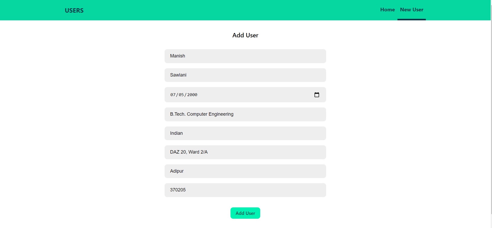

# MERN_CRUD

## CRUD Application Using:

MongoDB 
ExpressJS 
ReactJS 
NodeJs 
 

Used:  
SASS Pre-compiler for css. 
Axios for API Intgration. 
Heroku for API Deployment
Netlify for App Deployment 

## Screen Shots

  

  

  

  

